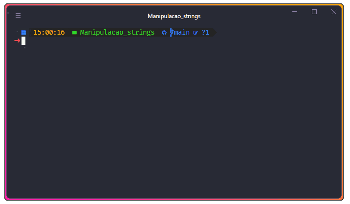

# Manipulação de Strings

Neste exercício, vamos criar uma função que verifica se uma palavra é um
palíndromo. Um palíndromo é uma palavra, frase, número ou qualquer sequência de
caracteres que permanece a mesma quando lida de trás para frente. Por exemplo,
"arara" é um palíndromo.

Neste exemplo, a função isPalindrome verifica se uma palavra é um palíndromo.
Ela remove os espaços em branco e converte a palavra para minúsculas para garantir
uma comparação insensível a maiúsculas/minúsculas. Em seguida, ela reverte a palavra
e verifica se a palavra limpa é igual à palavra revertida.

O código acima testa a função isPalindrome com um array de palavras e imprime
se cada palavra é ou não um palíndromo.
Espero que este exercício prático seja útil para você praEcar a manipulação de
strings em JavaScript!

## Tecnologias

## Professor Formador

- [@TheFilipeeringer](https://github.com/eringer)

# Resolução

