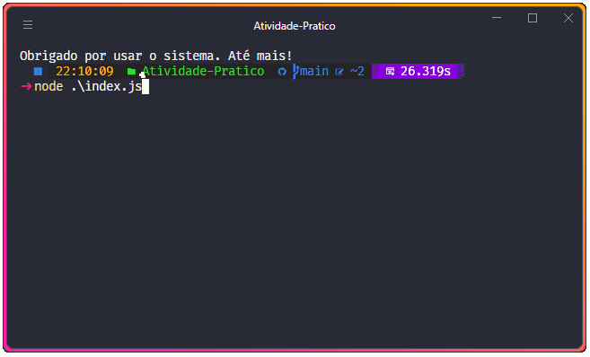

# Atividade prática da semana 4

Nesta tarefa você deverá fazer um sistema em JavaScript, utilizando Node.js, que dê ao usuário 3 opções:

<ol>
<li>Listar carros</li>
<li>Cadastrar novo carro</li>
<li>Sair do sistema</li>
</ol>

<ul>
<li>Cada carro deve ter as seguintes características: Placa, Nome e Montadora.</li>
<li>Você deve salvar os dados dos carros em um arquivo JSON.</li>
<li>Para listar os carros cadastrados, você deve fazer a leitura desse mesmo arquivo.</li>
<li>Para fazer a escrita e leitura do arquivo criado, use somente as funções assíncronas disponibilizadas pelo módulo fs (funções que não terminam com Sync)</li>
</ul>

#### Atenção!

Para as funcionalidades 1 e 2 do sistema, crie funções que retornam uma Promise. Você deve tratar o retorno dessas funções com o async/await.

Observe abaixo um exemplo do comportamento do sistema:

