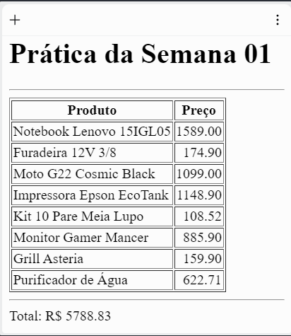

## Prática da Semana 1

Elabore um código no arquivo script.js para ler o preço de cada um dos produtos de uma tabela na página index.html. Utilizando JavaScript, escreva o valor da soma dos preços dos produtos ao final da página.

### Exemplo de execução do programa

