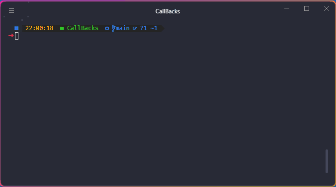

# CallBacks

Vamos criar um exercício prático para entender melhor o conceito de callbacks em
JavaScript. Suponha que temos uma função baixarConteudo que simula o download de
um conteúdo da internet. Esta função recebe dois parâmetros: o nome do conteúdo e
uma função de callback que será chamada quando o download estiver concluído.

Neste exemplo, a função baixarConteudo simula o download de um conteúdo e chama
a função de callback (callbackConcluirDownload) quando o download é concluído. O
uso de callbacks é comum em operações assíncronas, como download de arquivos,
chamadas de API, etc.
Observe que a função baixarConteudo recebe o nome do conteúdo e a função de
callback como parâmetros. Após o término do download simulado, a função de callback
é chamada, indicando que o download foi concluído. Este é um exemplo básico para
ilustrar como os callbacks podem ser utilizados em situações assíncronas em JavaScript.

# Resolução

